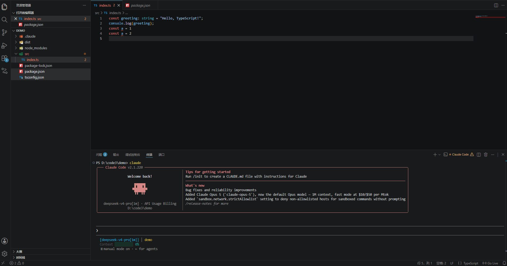

# Add to Terminal

> 一键将文件引用、选中代码行范围、编译报错信息发送到终端，专为 [Claude Code CLI](https://claude.com/claude-code) 工作流优化。



## 痛点分析

在使用 Claude Code 等终端 AI 编程工具时，最常见的操作是让 AI 帮你**定位问题、修改代码、修复报错**。但每次你都需要手动完成以下步骤：

1. 在编辑器或资源管理器中复制出问题的文件路径
2. 回到终端，粘贴路径
3. 回编辑器复制报错信息
4. 又回到终端粘贴上错误信息
5. 最后输入你的问题，回车

这个流程**频繁打断编码思路**，每次至少要花 10-20 秒手动拼接路径和行号，一天下来浪费大量时间。文件路径一长，还容易打错。

## 解决方案

**Add to Terminal** 让这一切**一键完成**。无论你在编辑器中、在文件资源管理器中、还是看到编译报错的红色波浪线，只需要一次点击或快捷键，文件引用和诊断信息就直接出现在终端输入框中——未执行，你可以继续补充问题描述，然后回车。

## 核心功能

### 📄 文件 + 行号引用

在编辑器中 **右键** 或按 **`Ctrl+Alt+T`**（Mac: `Cmd+Alt+T`），自动将当前文件路径和选中行范围发送到终端：

```
`src/extension.ts:42-58`
```

- 单行光标：`` `src/extension.ts:42` ``
- 多行选中：`` `src/extension.ts:42-58` ``
- 路径格式可配置（相对路径 / 绝对路径 / 仅文件名）

### 📁 资源管理器文件引用

在文件资源管理器中**右键任意文件**，一键将文件路径发送到终端：

```
`src/extension.ts`
```

支持**多选文件**，用逗号分隔：

```
`src/extension.ts`, `src/utils.ts`, `package.json`
```

### 🔴 报错信息一键添加

光标放在**红色波浪线**（编译错误）或**黄色波浪线**（警告）上，点击出现的💡**灯泡图标**（或 `Ctrl+.`），在 Quick Fix 菜单中点击 **"Add to Terminal"**：

```
`src/app.ts:42` error: Cannot find name 'foo'
`src/utils.ts:15` warning: Unused variable 'x'
```

> 这意味着你看到报错 → 点灯泡 → 点 Add to Terminal → 终端里直接有了 `路径+行号+错误信息` → 输入你的问题 → 回车，Claude Code 立刻开始分析。

## 使用场景

| 场景 | 操作 | 终端输出 |
|---|---|---|
| 让 AI 分析某段代码 | 编辑器选中代码行 → `Ctrl+Alt+T` | `` `src/app.ts:30-45` `` |
| 让 AI 修复报错 | 光标放红色波浪线 → 灯泡 → Add to Terminal | `` `src/app.ts:42` error: Cannot find name 'foo' `` |
| 让 AI 了解项目结构 | 资源管理器选中多个文件 → 右键 → Add to Terminal | `` `src/index.ts`, `src/utils.ts`, `package.json` `` |
| 让 AI 审查代码 | 选中代码 → 右键 → Add to Terminal → 继续输入"review this" | `` `src/app.ts:30-45` review this `` |

## 发送到 DSH Web 输入框

除终端外，引用也可以直接投递到 **DSH Web 页面的输入框草稿**（不提交，你补一句话再回车）。

```
@src/app.ts:30-45
@src/app.ts:42 error: Cannot find name 'foo'
```

- 面板/状态栏会告诉你投给了哪个会话（例如 `docs.10coding-demos · 线性代数讲义`）；
- 路径：相对路径只在文件确实位于该 DSH 会话工作目录下时使用，否则自动退化为绝对路径；
- 多个引用换行分隔；
- 目标页面断开或没有输入框时，按 `addToTerminal.fallbackToTerminal` 自动回退到终端。

前置条件：DSH 侧安装 `dsh-add-to-terminal` 桥接插件（它会把自己的地址与令牌写到 `<系统临时目录>/dsh-add-to-terminal/bridge.json`，本扩展读取后零配置可用）。

> **只用终端也完全没问题。** 没装桥接插件、没开 DSH Web、或者你自己点了「断开」，这三种情况下扩展不会弹失败提示：引用直接发给终端，状态栏只说一句「只发到终端」。DSH 只是多出来的一个投递目标，不是必需条件。

### 选择投递到哪个 DSH 页面

左侧**资源管理器侧边栏**里会多出一个 **DSH 页面** 区块，列出当前打开着 DSH Web 的标签页：

- 每行显示 **工作区 · 标题**（例如 `docs.10coding-demos · 线性代数讲义`）与状态；正在投递的那一行标为 **`当前目标 · 可写`** 并带插头图标；
- **单击一行 = 连接它**：设为投递目标 → 立刻把当前选区投过去（行尾也有一个 🔌 行内按钮）；
- 目标按工作区记住，之后 `Ctrl+Alt+T` 一直投给它；
- 状态栏右下角显示 `🔌 DSH: docs.10coding-demos · 线性代数讲义`，点它弹出 Quick Pick 换目标或断开（命令面板：`Add to Terminal: 选择 DSH 页面`）；
- 区块标题栏有刷新按钮与一个**断开**按钮（⏏）；可见时每 3 秒自动刷新；
- 收到内容的那个浏览器标签页会把自己的标题前面加上 `●` 闪 6 秒 —— 这是"内容进了哪个标签页"最可靠的提示（页面无法可靠地把浏览器窗口提到前台）。

> 只有"页面开着、且当前有输入框"的标签页才会出现在列表里（草稿存在页面侧，宿主写不了）；没有打开 DSH 时列表显示「只发到终端」，引用按 `fallbackToTerminal` 发给终端。

### 断开 DSH · 只发到终端

接好之后想彻底不投 DSH 了，有三个入口，效果一样：

| 入口 | 位置 |
| --- | --- |
| 状态栏 → Quick Pick 第一项 | `$(debug-disconnect) 断开 DSH · 只发到终端` |
| DSH 页面区块标题栏的断开按钮 | 视图标题栏 |
| 当前目标那一行尾部的断开按钮 | 行内图标；命令面板里也有 `Add to Terminal: 断开 DSH · 只发到终端` |

断开后：忘记记住的目标、**不再探测桥接**（省掉每次投递的一次 HTTP），引用直接发终端，状态栏变成 `$(terminal) 只发到终端`。想连回来，点列表里任意一个 DSH 页面即可（断开状态按工作区记，不影响 `addToTerminal.destination` 设置）。

> `addToTerminal.dshFocus` **默认关闭**：浏览器判断"这个地址是否已经打开"是按完整 URL 比对的，带上锚点（`#...`）就会被当成新地址而**多开一个标签页**，所以默认不去动浏览器。确实想让浏览器打开/切到该地址时再手动打开它（此时只使用不含锚点的裸地址）。

## 快捷键

| 命令 | Windows / Linux | macOS |
|---|---|---|
| Add to Terminal | `Ctrl+Alt+T` | `Cmd+Alt+T` |

## 配置

| 设置项 | 说明 | 可选值 | 默认值 |
|---|---|---|---|
| `addToTerminal.destination` | 发送目标：DSH 输入框 / 终端 / 两者 | `dsh` / `terminal` / `both` | `dsh` |
| `addToTerminal.fallbackToTerminal` | DSH 投递失败（页面关闭或没有输入框）时回退到终端 | `true` / `false` | `true` |
| `addToTerminal.dshUrl` | DSH Web 地址，留空则读发现文件 | 例如 `http://127.0.0.1:3080` | 空 |
| `addToTerminal.dshToken` | 桥接令牌，留空则读发现文件 | 字符串 | 空 |
| `addToTerminal.dshFocus` | 投递成功后打开/切到该 DSH 地址（按下述原因默认关闭） | `true` / `false` | `false` |
| `addToTerminal.dshPathStyle` | DSH `@` 引用里的路径风格 | `relative` / `absolute` | `relative` |
| `addToTerminal.pathFormat` | 终端目标的路径格式 | `relative` / `absolute` / `basename` | `relative` |

> 想要原来的行为（一律发到终端）：把 `addToTerminal.destination` 设为 `terminal`。

## 安装

### 从 VS Code 插件市场安装（推荐）

1. 打开 VS Code，按 `Ctrl+Shift+X` 打开扩展面板
2. 搜索 **"Add to Terminal"**
3. 点击 **Install** 安装
4. 安装后自动启用，无需额外配置

或者直接访问：[VS Code Marketplace - Add to Terminal](https://marketplace.visualstudio.com/items?itemName=EeLynn.add-to-terminal)


## 为什么用 Add to Terminal？

| | 手动操作 | 用 Add to Terminal |
|---|---|---|
| 输入文件引用 | 复制粘贴路径 + 行号，容易出错 | 一键，零出错 |
| 添加报错信息 | 复制报错 → 切换窗口 → 粘贴 | 灯泡菜单一键 |
| 多文件引用 | 逐个手打，逗号分隔 | 多选文件一键 |
| 打断编码思路 | 频繁切换 | 无缝衔接，思路不中断 |

## License

MIT
